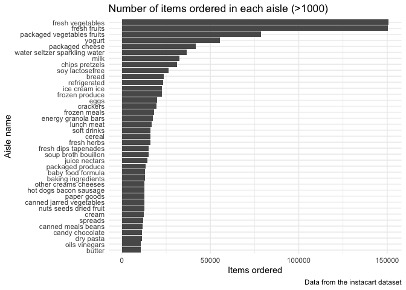
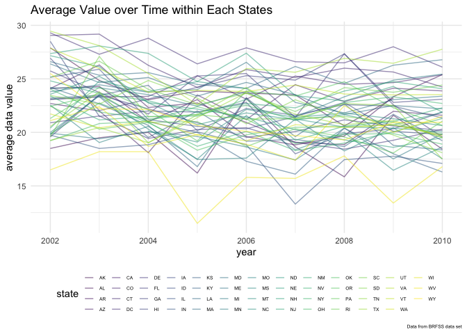
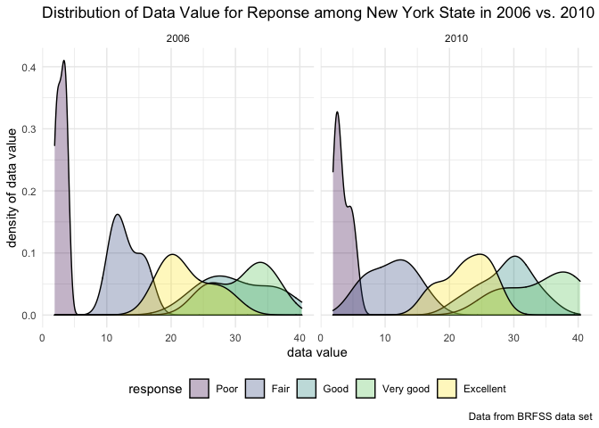
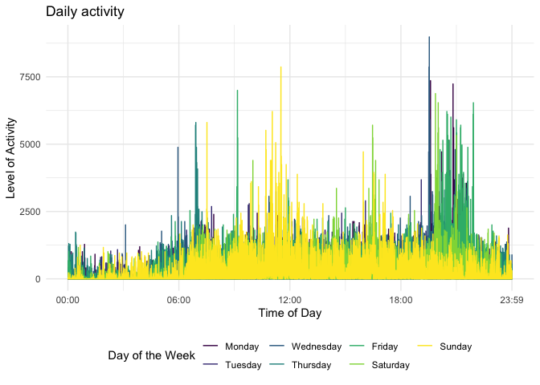

P8105 HW3
================
Hansheng Zhang
2021-10-20

``` r
library(tidyverse)
```

    ## ── Attaching packages ─────────────────────────────────────── tidyverse 1.3.1 ──

    ## ✓ ggplot2 3.3.5     ✓ purrr   0.3.4
    ## ✓ tibble  3.1.4     ✓ dplyr   1.0.7
    ## ✓ tidyr   1.1.3     ✓ stringr 1.4.0
    ## ✓ readr   2.0.1     ✓ forcats 0.5.1

    ## ── Conflicts ────────────────────────────────────────── tidyverse_conflicts() ──
    ## x dplyr::filter() masks stats::filter()
    ## x dplyr::lag()    masks stats::lag()

``` r
library(readxl)
library(p8105.datasets)

knitr::opts_chunk$set(
  warning = FALSE,
  message = FALSE
)
theme_set(theme_minimal() + theme(legend.position = "bottom"))
options(
  ggplot2.continuous.colour = "viridis",
  ggplot2.continuous.fill = "viridis"
)
scale_colour_discrete = scale_colour_viridis_d
scale_fill_discrete = scale_fill_viridis_d
```

# Problem 1

Exploration of instacart dataset

``` r
library(p8105.datasets)
data("instacart")
data("brfss_smart2010")
```

The `instacart` dataset has 1384617 observations of 15 variables. The
variable names are order\_id, product\_id, add\_to\_cart\_order,
reordered, user\_id, eval\_set, order\_number, order\_dow,
order\_hour\_of\_day, days\_since\_prior\_order, product\_name,
aisle\_id, department\_id, aisle, department. Variables that are
specific to the items include `product_id`, `department`,
`product_name`, and `aisle`. Vvariables that are specific to the
consumer include `reordered`, `user_id`, `days_since_prior_order`, and
`order_dow`. This dataset has 131209 unique customers.

``` r
instacart %>% 
  count(aisle) %>% 
  arrange(desc(n))
```

    ## # A tibble: 134 × 2
    ##    aisle                              n
    ##    <chr>                          <int>
    ##  1 fresh vegetables              150609
    ##  2 fresh fruits                  150473
    ##  3 packaged vegetables fruits     78493
    ##  4 yogurt                         55240
    ##  5 packaged cheese                41699
    ##  6 water seltzer sparkling water  36617
    ##  7 milk                           32644
    ##  8 chips pretzels                 31269
    ##  9 soy lactosefree                26240
    ## 10 bread                          23635
    ## # … with 124 more rows

There are 134 aisles. The aisles items are ordered from the most are:

1.  fresh vegetables  
2.  fresh fruits  
3.  packaged vegetable fruits  
4.  yogurt  
5.  packaged cheese

Plot that shows number of items ordered in each aisle

``` r
instacart %>% 
  group_by(aisle) %>% 
  summarize(item_count = n()) %>% 
  filter(item_count > 10000) %>% 
  ggplot(aes(x = reorder(aisle, item_count), y = item_count)) +
  geom_bar(stat = "identity") +
  coord_flip() + 
  labs(
    title = "Number of items ordered in each aisle (>1000)",
    x = "Aisle name",
    y = "Items ordered",
    caption = "Data from the instacart dataset"
  )
```

<!-- -->

This table shows the three most popular items in each of the aisles
“baking ingredients”, “dog food care”, and “packaged vegetables fruits”
and the number of times each item is ordered.

``` r
instacart %>% 
  filter(aisle %in% c("baking ingredients", "dog food care", "packaged vegetables fruits")) %>% 
  group_by(aisle) %>% 
  count(product_name) %>% 
  mutate(rank = min_rank(desc(n))) %>% 
  filter(rank < 4) %>% 
  arrange(aisle, rank) %>% 
  knitr::kable()
```

| aisle                      | product\_name                                 |    n | rank |
|:---------------------------|:----------------------------------------------|-----:|-----:|
| baking ingredients         | Light Brown Sugar                             |  499 |    1 |
| baking ingredients         | Pure Baking Soda                              |  387 |    2 |
| baking ingredients         | Cane Sugar                                    |  336 |    3 |
| dog food care              | Snack Sticks Chicken & Rice Recipe Dog Treats |   30 |    1 |
| dog food care              | Organix Chicken & Brown Rice Recipe           |   28 |    2 |
| dog food care              | Small Dog Biscuits                            |   26 |    3 |
| packaged vegetables fruits | Organic Baby Spinach                          | 9784 |    1 |
| packaged vegetables fruits | Organic Raspberries                           | 5546 |    2 |
| packaged vegetables fruits | Organic Blueberries                           | 4966 |    3 |

This table shows the mean hour of the day at which Pink Lady Apples and
Coffee Ice Cream are ordered on each day of the week.

``` r
instacart %>% 
  mutate(
  order_dow = recode(order_dow,
                       "0" = "Sunday",
                       "1" = "Monday",
                       "2" = "Tuesday",
                       "3" = "Wednesday",
                       "4" = "Thursday",
                       "5" = "Friday",
                       "6" = "Saturday")
  ) %>% 
  filter(product_name %in% c("Pink Lady Apples", "Coffee Ice Cream")) %>% 
  group_by(product_name, order_dow) %>% 
  summarize(mean_hour = mean(order_hour_of_day)) %>% 
  pivot_wider(
    names_from = order_dow,
    values_from = mean_hour
  ) %>% 
  select(product_name, Monday, Tuesday, Wednesday, Thursday, Friday, Saturday, Sunday,
         everything())
```

    ## # A tibble: 2 × 8
    ## # Groups:   product_name [2]
    ##   product_name     Monday Tuesday Wednesday Thursday Friday Saturday Sunday
    ##   <chr>             <dbl>   <dbl>     <dbl>    <dbl>  <dbl>    <dbl>  <dbl>
    ## 1 Coffee Ice Cream   14.3    15.4      15.3     15.2   12.3     13.8   13.8
    ## 2 Pink Lady Apples   11.4    11.7      14.2     11.6   12.8     11.9   13.4

# Problem 2

Data cleaning and exploration of BRFSS data set

``` r
brfss_df = 
  brfss_smart2010 %>% 
  janitor::clean_names() %>% 
  filter(topic == "Overall Health") %>% 
  mutate(
    response = factor(response, levels = c("Poor", "Fair", "Good", "Very good", "Excellent"),
                      ordered = TRUE
                      )
    ) %>% 
    rename(
    state = locationabbr,
    location = locationdesc
    )
```

``` r
brfss_2002 =
  brfss_df %>% 
  filter(year == 2002) %>% 
  group_by(state) %>% 
  distinct(location) %>% 
  summarize(num_location = n()) %>% 
  filter(num_location >= 7) %>% 
  pull(state)
brfss_2010 =
  brfss_df %>% 
  filter(year == 2010) %>% 
  group_by(state) %>% 
  distinct(location) %>% 
  summarize(num_location = n()) %>% 
  filter(num_location >= 7) %>% 
  pull(state)
```

In 2002, states that were observed at 7 or more locations are CT, FL,
MA, NC, NJ, PA. In 2010, states that were observed at 7 or more
locations are CA, CO, FL, MA, MD, NC, NE, NJ, NY, OH, PA, SC, TX, WA.

Plot of the average data value over time within a state

``` r
excellent_df <- 
  brfss_df %>% 
  filter(response == "Excellent") %>% 
  group_by(state, year) %>% 
  summarize(
    mean_data_value = mean(data_value, na.rm = TRUE)
  )
excellent_df %>% 
  ggplot(aes(x = year, y = mean_data_value, color = state)) +
  geom_line(alpha = 0.5) +
  labs(
    y = "average data value",
    title = "Average Value over Time within Each States",
    caption = "Data from BRFSS data set"
  ) +
  theme(
    plot.caption = element_text(size = 5),
    legend.key.size = unit(0.4, "cm"),
    legend.text = element_text(size = 5)
  ) +
  guides(color = guide_legend(nrow = 4))
```

<!-- -->

Make a two-panel plot showing, for the years 2006, and 2010,
distribution of data\_value for responses (“Poor” to “Excellent”) among
locations in NY State

``` r
brfss_df %>% 
  filter(year %in% c(2006, 2010), state == "NY") %>% 
  ggplot(aes(x = data_value, fill = response)) +
  geom_density(alpha = .3) +
  facet_grid(. ~ year) +
  labs(y = "density of data value",
       x = "data value",
    title = "Distribution of Data Value for Reponse among New York State in 2006 vs. 2010",
    caption = "Data from BRFSS data set")
```

<!-- -->

# Problem 3

Tidy and clean accelerometer data and then create a table and a plot.

``` r
accel_data = read_csv("./Data/accel_data.csv") %>% 
    pivot_longer(
        activity.1:activity.1440,
        names_to = "activity",
        values_to = "activity_count") %>% 
    mutate(
        day_type = case_when(
            day %in% c("Saturday", "Sunday") ~ "weekend",
            TRUE ~ "weekday"),
        day = fct_relevel(day, c("Monday", "Tuesday", "Wednesday", "Thursday", "Friday", "Saturday", "Sunday")))
```

There are total 50400 observations and 6 variables. The variables in
this data set are week, day\_id, day, activity, activity\_count,
day\_type.

``` r
accel_data %>% 
    group_by(week, day) %>% 
    summarize(day_total = sum(activity_count)) %>% 
    mutate(day_total = round(day_total, digits = 0)) %>% 
    pivot_wider(
        names_from = day,
        values_from = day_total) %>% 
    rename("Week" = week) %>% 
    knitr::kable()
```

| Week | Monday | Tuesday | Wednesday | Thursday | Friday | Saturday | Sunday |
|-----:|-------:|--------:|----------:|---------:|-------:|---------:|-------:|
|    1 |  78828 |  307094 |    340115 |   355924 | 480543 |   376254 | 631105 |
|    2 | 295431 |  423245 |    440962 |   474048 | 568839 |   607175 | 422018 |
|    3 | 685910 |  381507 |    468869 |   371230 | 467420 |   382928 | 467052 |
|    4 | 409450 |  319568 |    434460 |   340291 | 154049 |     1440 | 260617 |
|    5 | 389080 |  367824 |    445366 |   549658 | 620860 |     1440 | 138421 |

No significant activity trends appear. However, the last two weekends
showed much lower activity counts than in previous weeks and weekends.
Furthermore, the middle of the week generally showed less activity
counts than other days of the week.

Time plot of all the activity metrics across each day of the week by the
minute.

``` r
accel_data %>% 
    mutate(min_of_day = as.integer(str_sub(activity, 10, -1))) %>% 
    ggplot(aes(x = min_of_day, y = activity_count, color = day)) +
    geom_line() +
    scale_x_continuous(
        breaks = c(0, 360, 720, 1080, 1440),
        labels = c("00:00", "06:00", "12:00", "18:00", "23:59")) +
    labs(
        title = "Daily activity",
        x = "Time of Day",
        y = "Level of Activity") +
    viridis::scale_color_viridis(
        name = "Day of the Week", 
        discrete = TRUE)
```

<!-- -->

The patient had increased activity on Sunday around 11:00, and on Friday
and Saturday night around 20:00 to 22:00.
